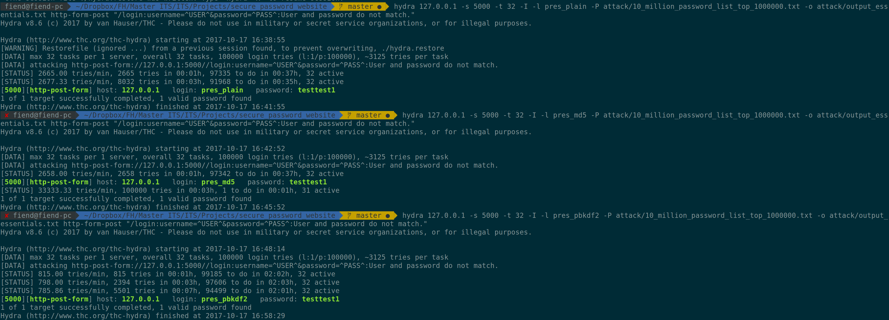

# Sichere Passwortspeicherung
Um Passwörter sicher in Datenbanken zu speichern, haben sich über die Jahre verschiedenste Ansätze entwickelt, die mal mehr, mal weniger sicher sind. Im Rahmen dieses Projekts gehen wir auf drei verschiedene Möglichkeiten der Passwortspeicherung ein.
1. Plaintext
2. Gehasht (MD5)
3. PBKDF2

Zur Demonstration wird eine simple Website entwickelt, bei der User sich über einen Login authentifizieren müssen, um auf einen geschützten Bereich zugreifen zu können. Dies wird mit folgenden Technologien realisiert:
* Python
* Flask
* Jinja2
* SQLAlchemy
* PostgreSQL

___ACHTUNG! Dieses Projekt zeigt nur, wie Passwörter sicher gespeichert werden können. Es ist ist keine Referenzimplementierung und beinhaltet weder Session Management, noch sonstige Sicherheitsvorkehrungen, die bei modernen Websites Standard sein sollten.___

___Dies wird unter Umständen im Test-Branch___ ```flask-security``` ___implementiert.___

## Voraussetzungen
Es sollten folgende Pakete installiert sein:
* ```python3```
* ```pip```
* ```python-flask```
* ```python-django```
* ```pbkdf2```
* (optional) ```pyopenssl``` für HTTPS

___ACHTUNG! Alle Shell-Scripts sind auf Arch ausgelegt. Sie funktionieren großteils auch unter anderen Distros, bitte ggf. je nach Distro bitte anpassen.___

## PostgreSQL
Um unsere Passwört sicher (oder unsicher) zu speichern, wird eine PostgreSQL-Datenbank eingerichtet und die Tabelle "Users" erzeugt.

### Installation

1. postgresql-Paket und PostgreSQL-Erweiterung für Python installieren

```
$ sudo pacman -S postgresql
$ sudo pip install psycopg2
```

2. zu postgres user wechseln und Datenbank initialisieren

```
$ sudo -u postgres -i
$ initdb --locale $LANG -E UTF-8 -D '/var/lib/postgres/data'
```

4. aus postgres user aussteigen

```$ exit```

5. postgres service einschalten und starten

```
$ sudo systemctl enable postgresql.service
$ sudo systemctl start postgresql.service
```

mit Postgres User die DB erstellen

```
$ sudo -u postgres -i
$ createdb secure_password_storage
```

Rolle anlegen & übernehmen

```
$ create role dbadmin with superuser login createdb
$ set role
```

pgcrypto extension für UUID Erstellung

```$ create extension pgcrypto;```


### Tabellen
Für dieses Beispiel benötigen wir eigentlich nur eine Usertabelle, in der neben dem Usernamen zumindest das Passwort (in welcher Form auch immer) hinterlegt wird.

```sql
CREATE TABLE users (
  user_id         UUID PRIMARY KEY DEFAULT gen_random_uuid(),
  username        TEXT UNIQUE,
  usernumber      SERIAL UNIQUE,
  password        TEXT,
  password_md5    TEXT,
  password_pbkdf2 TEXT,
  salt            TEXT,
  iterations      INTEGER
);
```
## Cracking
Ziel hierbei ist es, zu zeigen, dass "normale" Hashalgorithmen sehr schnell sind, und darum eine Attacke darauf rentabel sein kann. Bei PBKDF2 ist das Ziel, einen langsamen Algorithmus zu haben, bei dem sich Brute Force Attacken nicht mehr auszahlen und auch Rainbow Tables ihre Wirkung verlieren.
* Brute Force mit Passwortlisten
    * Plain
    * MD5
    * PBKDF2
* Rainbow Table
    * MD5

### Voraussetzungen
* ```hydra```
* ```john``` (John the Ripper)
* ```hashcat```
* ```burpsuite``` (in [AUR](https://aur.archlinux.org/))
* [Passwort Listen](https://github.com/danielmiessler/SecLists/tree/master/Passwords) (zB Ashley_Madison.txt)

### Burpsuite

#### Aufklärung mit Burpsuite
1. Unter dem Tab "Proxy" sicherstellen, dass
    1. unter "Options" der Proxy Listener läuft (running ☑️)
    1. unter "Intercept" der Toggle "Intercept is on" gesetzt ist.
1. In den Proxy-Settings (Global oder je Browser) den erstellten Proxy-Listener samt Port (zB 127.0.0.1:8080) eintragen. ___Dabei unbedingt darauf achten, DASS LOCALHOST NICHT ALS AUSNAHME GESETZT IST!___
1. Auf der Loginseite eine beliebige Username:Passwort Kombination eingeben.
1. Burpsuite fängt den Request ab und gibt ihn unter "Proxy">"Intercept" aus

#### Angriff mit Hydra
Der Aufruf von Hydra ist sehr umfangreich und daher fehleranfällig für falsche Parameter (___Case sensitivity beachten!___), mehr dazu in ```hydra -h```. Generell erfolgt ein Angriff auf ein Live-System mit folgendem Befehl:

```
$ hydra 127.0.0.1 -s 5000 -t 32 -I -L attack/pres_users.txt -P attack/10_million_password_list_top_1000000.txt -o attack/output.txt http-form-post "/login:username=^USER^&password=^PASS^:User and password do not match."
```

```127.0.0.1 -s 5000``` - Ziel ist localhost auf Port 5000 angegriffen wird.

```-t 32``` - es werden maximal 32 tasks pro Server pro Sekunde versucht. 

```-I``` - sollte eine abgebrochene Session bestehen, wird diese ohne Warnung überschrieben.

```
-L attack/pres_users.txt 
-P attack/10_million_password_list_top_1000000.txt 
-o attack/output.txt
```
* -L ist die Liste der Usernamen (alternativ kann -l für einen einzelnen User genommen werden)
* -P ist die Passwortliste
* -o ist die Output-Datei, in der die gefundenen Passwörter gespeichert werden.

Output

```
Hydra v8.6 (c) 2017 by van Hauser/THC - Please do not use in military or secret service organizations, or for illegal purposes.

Hydra (http://www.thc.org/thc-hydra) starting at 2017-10-08 20:27:04
[WARNING] Restorefile (ignored ...) from a previous session found, to prevent overwriting, ./hydra.restore
[DATA] max 32 tasks per 1 server, overall 32 tasks, 3000003 login tries (l:3/p:1000001), ~93751 tries per task
[DATA] attacking http-post-form://127.0.0.1:5000//login:username=^USER^&password=^PASS^:User and password do not match.
[STATUS] 2657.00 tries/min, 2657 tries in 00:01h, 2997346 to do in 18:49h, 32 active
[5000][http-post-form] host: 127.0.0.1   login: pres_plain   password: testtest1
[STATUS] 334335.33 tries/min, 1003006 tries in 00:03h, 1996997 to do in 00:06h, 32 active
[5000][http-post-form] host: 127.0.0.1   login: pres_md5   password: testtest1
[STATUS] 286063.57 tries/min, 2002445 tries in 00:07h, 997558 to do in 00:04h, 32 active
[5000][http-post-form] host: 127.0.0.1   login: pres_pbkdf2   password: testtest1
1 of 1 target successfully completed, 3 valid passwords found
Hydra (http://www.thc.org/thc-hydra) finished at 2017-10-08 20:37:47

```

##### Geschwindigkeiten beim Angriff
Im folgenden Screenshot wird der Unterschied zwischen den verschiedenen Hash- bzw. Plaintext-Varianten ersichtlich.
 
Während eine Dictionary-Attacke auf ein Plaintextpasswort ungefähr gleich schnell ist, wie ein Angriff auf ein MD5-gehashtes Passwort, so zeigt sich klar, dass PBKDF2 zu einem erheblich höheren Zeitaufwand führt. Die Plaintext und MD5-Passwörter konnten binnen 3 Minuten geknackt werden. Für die PBKDF2-gehashte Variante werden bereits 10 Minuten benötigt.

_Anmerkung: bei den 33333.33 tries/min nach dem Fund des MD5-Passwortes dürfte es sich um einen statistischen Fehler/Darstellungsfehler handeln._

